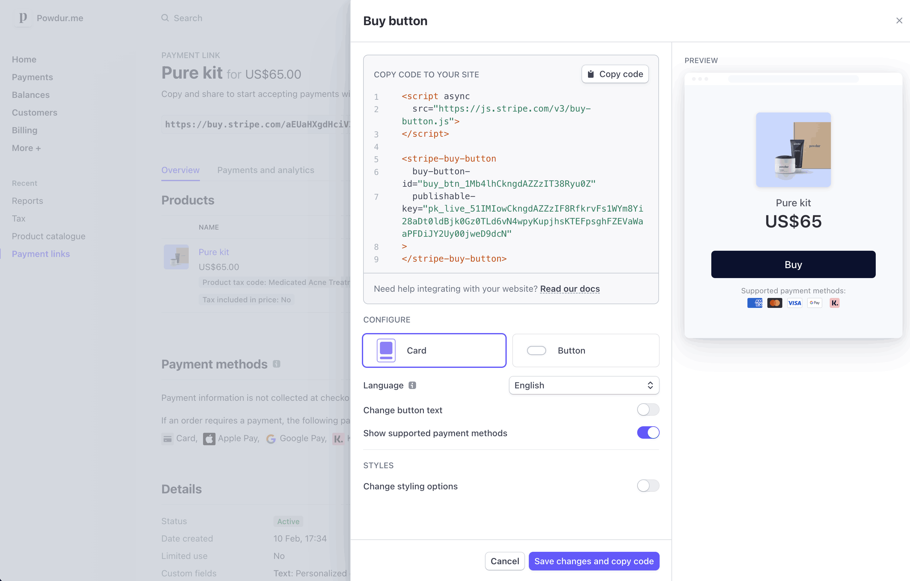

<style>
    .description{
        font-size: 12px;
        text-align: center;
        color: grey;
    }
</style>

[Home](https://platonsolm.github.io/StripeDocs-Documentation/) / [Create an embeddable buy button](#)
# Create an embeddable buy button

### Use Payment Links to create an embeddable buy button for your website.
Create an embeddable buy button to sell a product, subscription, or accept a payment on your website. Start by selecting an existing link from the [Payment Links list view]() or by [creating a new link]() where you can decide which products to sell and customize the checkout UI. After you create your link, click **Buy button** to configure the buy button design and generate the code that you can copy and paste into your website.

### Customize the button
By default, your buy button uses the same branding and call to action configured for your payment link. You can:

- Choose between a simple button and a card widget.
- Set brand colors, shapes, and fonts to match your website.
- Set the language of the button and payment page to match your website’s language.
- Customize your button’s call to action.


<p class="description">Customize the buy button</p>

### Embed the button
Stripe provides an embed code composed of a `<script>` tag and a `<stripe-buy-button>` web component. Click **Copy code** to copy the code and paste it into your website.

If you’re using HTML, paste the embed code into the HTML. If you’re using React, include the script tag in your `index.html` page to mount the `<stripe-buy-button>` component.

!!! warning
    The buy button uses your account’s [publishable API key](). If you revoke the API key, you need to update the embed code with your new publishable API key.

``` html title="index.html"
<body>
  <h1>Purchase your new kit</h1>
  <!-- Paste your embed code script here. -->
  <script
    async
    src="https://js.stripe.com/v3/buy-button.js">
  </script>
  <stripe-buy-button
    buy-button-id="{{BUY_BUTTON_ID}}"
    publishable-key="pk_test_51EnkCZCLU6thghKmNHiHQ73IHaigYIluWMELqWVMln10heSz4xpma7dJwmAuMBhYAVTQ76PrC6M0LvmsUxhNzKC500RL4elxGV"
  >
  </stripe-buy-button>
</body>
```
### Attributes to customize checkout
| PARAMETER | DESCRIPTION | SYNTAX |
|:--------------|:------------| :----- |
| `client-reference-id` | Use `client-reference-id` to attach a unique string of your choice to the Checkout Session. The string can be a customer ID or a cart ID (or similar) that you use to reconcile the Session with your internal systems. If you pass this parameter to your `<stripe-buy-button>`, it’s sent in the [checkout.session.completed webhook]() upon payment completion. | `client-reference-id` can be composed of alphanumeric characters, dashes, or underscores, and be any value up to 200 characters. Invalid values are silently dropped, but your payment page continues to work as expected. |

Attribute `customer-email`

#### Description
Use `customer-email` to prefill the email address on the payment page. When the property is set, the buy button passes it to the Checkout Session’s `customer_email` attribute. The customer can’t edit the email address on the payment page.

#### Syntax
`customer-email` must be a valid email. Invalid values are silently dropped, but your payment pages continues to work as expected.

 - `customer-session-client-secret`
 - You can provide an existing [Customer object]() to Checkout Sessions created from the buy button. Create a customer session for a user you’ve already authenticated server-side, and return the `client_secret` to the client. Set the `customer-session-client-secret` attribute on the `<stripe-buy-button>` web component to be the `client_secret` from the Customer Session.
 - The `customer-session-client-secret` value must be generated from the `client_secret`.

### Pass an existing customer
You can provide an existing [Customer object]() to Checkout Sessions created from the buy button. Create a customer session for a user you’ve already authenticated server-side, and return the `client_secret` to the client.

```py title="server.py"
# Set your secret key. Remember to switch to your live secret key in production.
# See your keys here: https://dashboard.stripe.com/apikeys
import stripe
stripe.api_key = "sk_test_MMNDWMvpQe1ES6MzEzMDGu5a00gaF0XBFa"


stripe.CustomerSession.create(
    customer='{{CUSTOMER_ID}}',
    components={"buy_button": {"enabled": True}},
)
```
Set the `customer-session-client-secret` attribute on the `<stripe-buy-button>` web component to the `client_secret` from the Customer Session.

!!! note
    You must provide the `client_secret` within 30 minutes. After providing the client secret, you have an additional 30 minutes until the customer session expires. Any resulting Checkout Sessions created from the buy button will fail. Don’t cache the client secret, instead generate a new one every time you render each buy button.

```html title="index.html"
<body>
  <script
    async
    src="https://js.stripe.com/v3/buy-button.js">
  </script>
  <stripe-buy-button
    buy-button-id='{{BUY_BUTTON_ID}}'

    publishable-key="pk_test_51EnkCZCLU6thghKmNHiHQ73IHaigYIluWMELqWVMln10heSz4xpma7dJwmAuMBhYAVTQ76PrC6M0LvmsUxhNzKC500RL4elxGV"

    customer-session-client-secret="{{CLIENT_SECRET}}"
  >
  </stripe-buy-button>
</body>
```
### Content Security Policy
If you’ve deployed a [Content Security Policy](), the policy directives that the buy button requires are:

- frame-src, https://js.stripe.com
- script-src, https://js.stripe.com

### Limitations
Rendering the buy button requires a website domain. To test the buy button locally, run a local HTTP server to host your website’s `index.html` file over the localhost domain. To run a local HTTP server, use Python’s [SimpleHTTPServer]() or the [http-server]() npm module.

### Track payments
After your customer makes a payment using a payment link, you can see it in the [payments overview]() in the Dashboard.

If you’re new to Stripe, you’ll receive an email after your first payment. To receive emails for all successful payments, update your notification preferences in your [profile settings]().

Stripe creates a new [guest customer]() for one-time payments and a new [Customer]() when selling a subscription or [saving a payment method for future use]().

Learn more about handling [payment links post-payment](), like how to configure post-payment behavior for a buy button or payment link.
